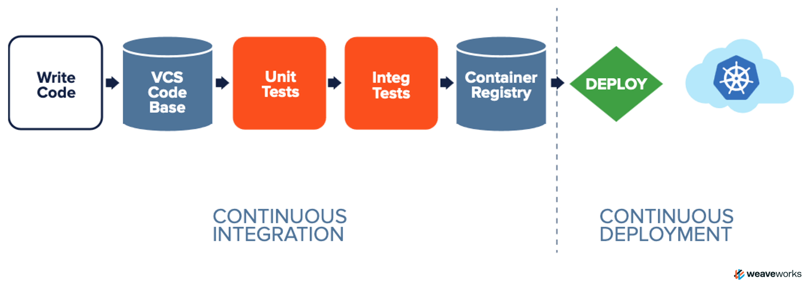
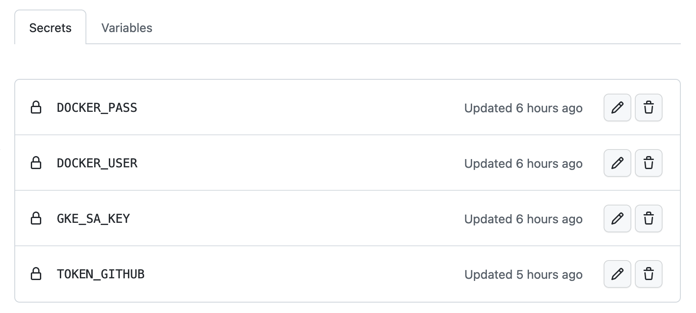
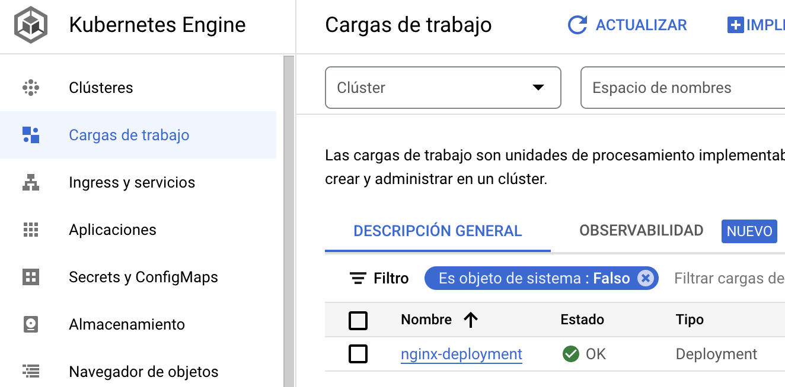
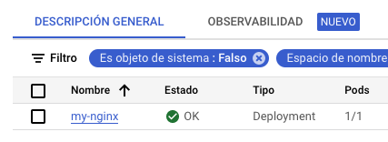

# GitOps T3chfest Aplication

En este taller vamos a realizar dos ejemplos de entrega continua para mostrar las diferencias y las ventajas de utilizar GitOps como método para desplegar vuestras aplicaciones.

## CICD automatizado sin GitOps

En el siguiente diagrama se especifica un ejemplo de un despliegue sin GitOps:



Vamos a utilizar las siguientes herramientas:

- Github
- Github Actions
- Dockerhub
- Kubernetes en GCP

## Cómo empezar

A continuación se detallarán todos los pasos necesarios para desplegar un ejemplo mediante un servidor web.

### Prerrequisitos

Para poder hacer el despliegue es necesario contar con:

- GCP: Usuario con acceso a la consola y cliente de gcloud instalado en local.
- Kubernetes: cliente de Kubectl instalado para interactuar con el clúster de Kubernetes.

- Incluir los siguientes secrets dentro del repositorio de Github:



- Y modificar las variables dentro de los scripts la cartpeta ".github/workflows" para que se correspondan con vuestro entorno:

```console
env:
  PROJECT_ID: <ID>
  GKE_CLUSTER: <CLUSTER>
  GKE_ZONE: <ZONE>
  IMAGE_NAME: <IMAGE>
  GITHUB_EMAIL: <EMAIL>
  GITHUB_NAME: <NAME>
```

## Despliegue

### Descarga de Software

Como primer paso, es necesario clonar el repositorio:

```console
git clone https://github.com/aggcastro/t3chfest-gitops-app.git
```

## Ejemplo de CI/CD sin GitOps

Para poder desplegar la aplicación en el clúster de Kubernetes lo primero que habría que hacer sería ejecutar el Job de Github Actions "cicd.yaml" en Github.

Una vez ejecutado, la aplicación se habrá desplegado correctamente en el servidor de Kubernetes.



## Ejemplo de CI/CD con GitOps

Para poder desplegar la aplicación en el clúster de Kubernetes lo primero que habría que hacer sería ejecutar el Job de Github Actions "gitops.yaml".

Una vez ejecutado, la aplicación se habrá desplegado correctamente en el servidor de Kubernetes.



Si queremos acceder al servidor web, será necesario ejecutar el siguiente comando en el terminal local:

```console
kubectl port-forward service/my-nginx 80:80
```

## Estructura del repositorio

- [.github](.github/workflows): workflows con los jobs de Git Actions.
- [images](images): imágenes que se han utilizado en este Readme para la documentación.
- [nginx](nginx): script con la configuración de ejemplo de un servidor web en Kubernetes.

## Documentación de referencia

- [Terraform](https://registry.terraform.io/providers/hashicorp/google/latest/docs/guides/using_gke_with_terraform)
- [Vault](https://developer.hashicorp.com/vault/docs)
- [Web3Signer](https://docs.web3signer.consensys.net/en/latest)
- [Teku](https://docs.teku.consensys.net/en/latest/)
- [Besu](https://besu.hyperledger.org/en/latest/)
